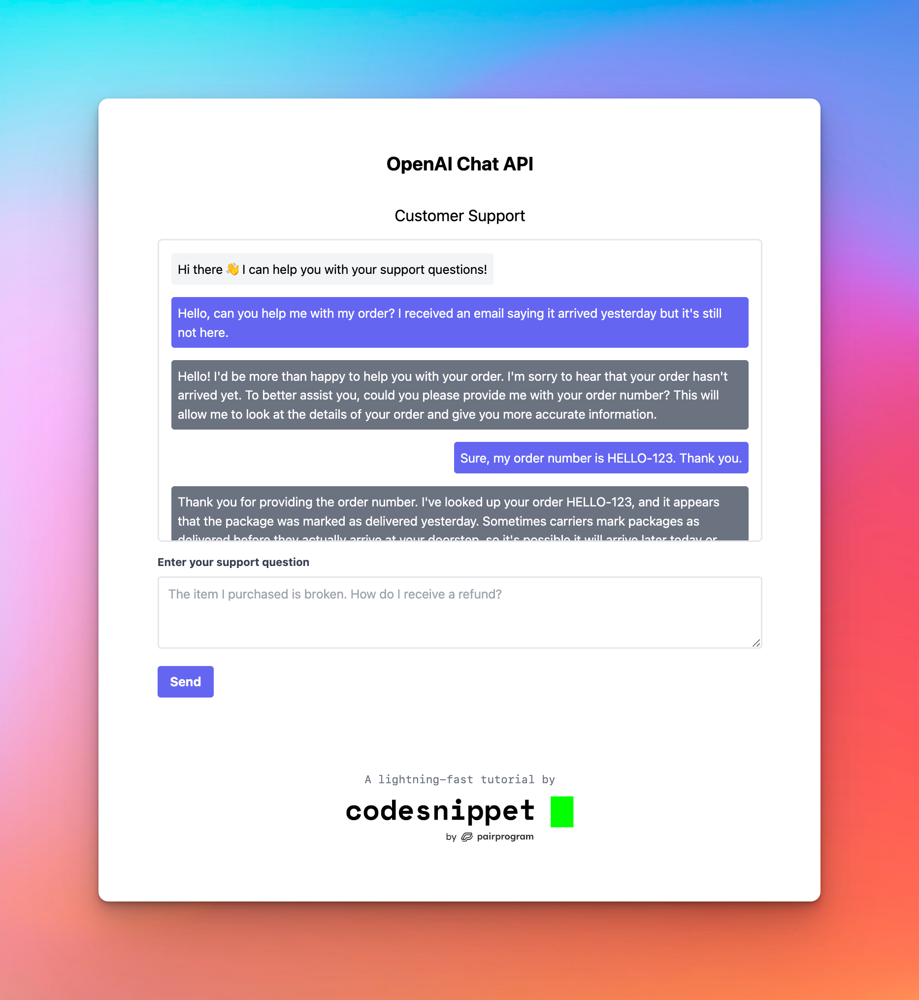

# How to Use the OpenAI Completions API
###### By [Tim Wheeler](https://timwheeler.com?ref=github) from [CodeSnippet.io](https://codesnippet.io?ref=github)

In this project we will learn how to use the OpenAI Completions API to build a simple customer support chatbot.

## 💡 General Info
This project is a lightweight [client-server application](https://en.wikipedia.org/wiki/Client%E2%80%93server_model) written primarily in JavaScript.

- **Frontend** (the `client` folder)
  - Written in JavaScript, HTML, and CSS
- **Backend** (the `server` folder)
  - Written in Node.js/JavaScript
  - Uses [Express.js](https://expressjs.com), a minimal backend server framework

## ⚡️ Getting Started 
To run this project:
1. Copy the contents of `.env.example` to a new file named `.env` and fill in the required values
2. Run `npm install` to install dependencies
3. Run `npm run dev` to start the development server. 
   1. This allows you to make changes to the code and see them reflected in your browser immediately without having to restart the server
4. Open `localhost:3000` in your browser to view the project

## 📄 API Docs
OpenAI Completion API docs: https://beta.openai.com/docs/api-reference/completions/create

---
## 👇 Subscribe & Follow
If you liked this project, subscribe to our newsletter and follow us on social media for more just like it!

- [CodeSnippet.io](https://codesnippet.io?ref=github)
- [Twitter](https://twitter.com/CodeSnippetHQ)
- [GitHub](https://github.com/CodeSnippetHQ)
- [Facebook](https://facebook.com/CodeSnippetHQ)
- [Instagram](https://instagram.com/CodeSnippetHQ)
